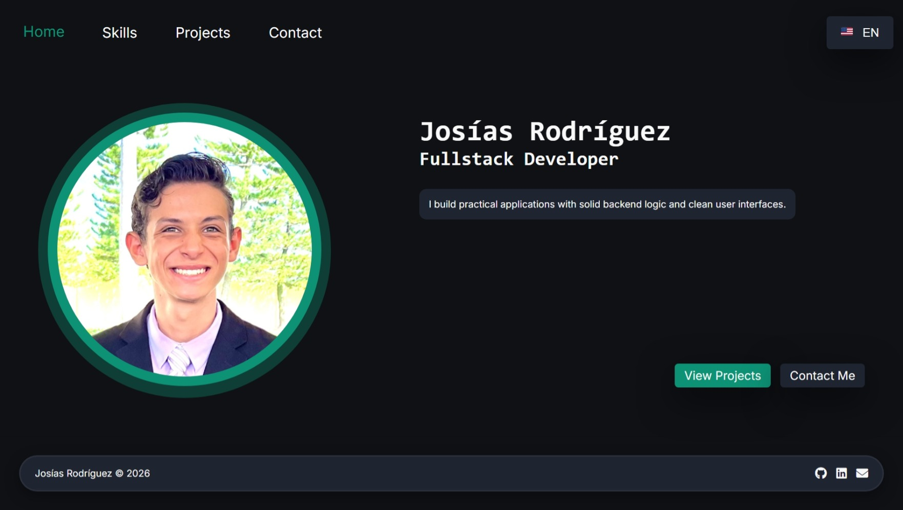
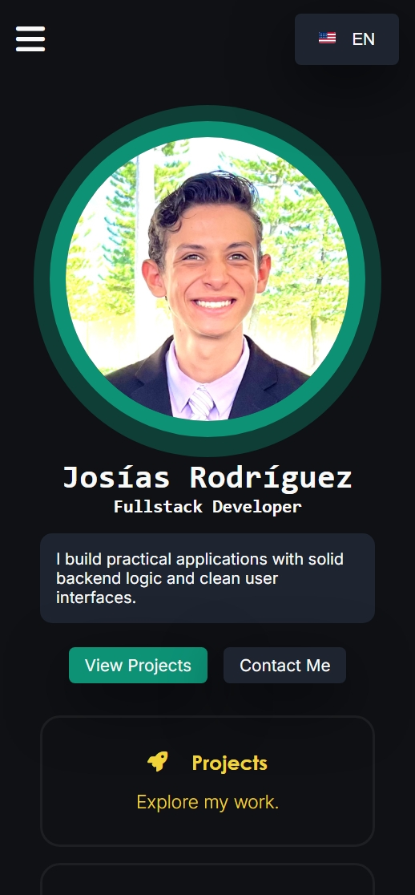

# Developer Portfolio

Personal portfolio website created to showcase professional projects, technical skills, and development experience.

This project demonstrates frontend development practices through a responsive Single Page Application (SPA) built with Vanilla JavaScript, HTML5, and CSS3.

The application includes a modular structure, client-side routing, bilingual support, and a focus on maintainability, performance, and user experience.

## Live Demo

The portfolio is available at:

🔗 [josiasrodriguez.dev](https://josiasrodriguez.dev/)

The website includes project showcases, skills overview, and contact information.

## Screenshots

| Desktop | Mobile |
|---|---|
|  |  |

## Technical Highlights

- Built a lightweight SPA without external frameworks.
- Implemented a custom client-side routing system.
- Created a reusable modular structure for pages and layouts.
- Developed an internationalization system with persistent language preferences.
- Designed a responsive interface following a mobile-first approach.
- Implemented a custom 404 page and navigation state management.
- Modular JavaScript architecture using ES modules.

## Tech Stack

### Frontend
- HTML5
- CSS3
- Vanilla JavaScript

### Architecture
- Single Page Application (SPA)
- Client-side Routing
- Modular JavaScript Structure

### Tools
- Git
- GitHub
- Vercel

## Why Vanilla JavaScript

The goal of this project was to demonstrate a strong understanding of JavaScript fundamentals and build a lightweight SPA without relying on external frameworks.

For a personal portfolio website, Vanilla JavaScript provided enough flexibility while keeping the project simple, performant, and easy to maintain.

## Project Structure

The project follows a modular structure separating styles, logic, localization files, layouts, and page components.

```text
/assets
    /icons
    /images
/src
    /css
    /js
    /lang
    /layouts
    /pages
index.html
README.md
vercel.json
```

## Getting Started

1. Clone the repository:

```bash
git clone https://github.com/josiasrodri-dev/developer-portfolio.git
```
2. Open the project folder.
3. Run the application using a local development server such as VS Code Live Server.

## Design Principles

- **Simplicity:** Keep the solution lightweight without sacrificing structure.
- **Maintainability:** Organize the codebase to support future improvements.
- **Responsive Design:** Ensure consistent experience across different devices.
- **Performance:** Reduce unnecessary dependencies and loading overhead.
- **Consistency:** Use CSS variables and design tokens to maintain visual coherence.

## Technical Decisions

### Vanilla JavaScript Architecture

Instead of using a framework, this project uses a custom modular structure to demonstrate JavaScript fundamentals.

### Client-side Routing

A lightweight routing system was implemented to manage navigation without external dependencies.

### Internationalization

The application uses separated language files and localStorage to persist user preferences.

## License

This project is licensed under the MIT License.

## Author

Josías Rodríguez

- GitHub: [josiasrodri-dev](https://github.com/josiasrodri-dev)
- LinkedIn: [Josías Rodríguez](https://linkedin.com/in/josiasrodri)
- Portfolio: [josiasrodriguez.dev](https://josiasrodriguez.dev/)